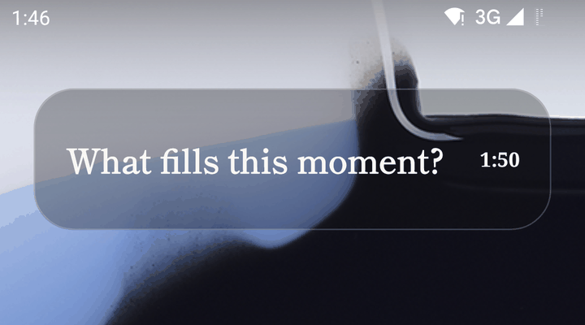
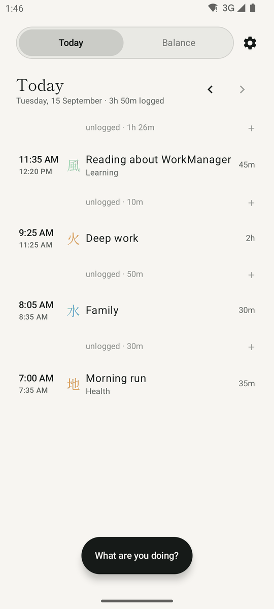
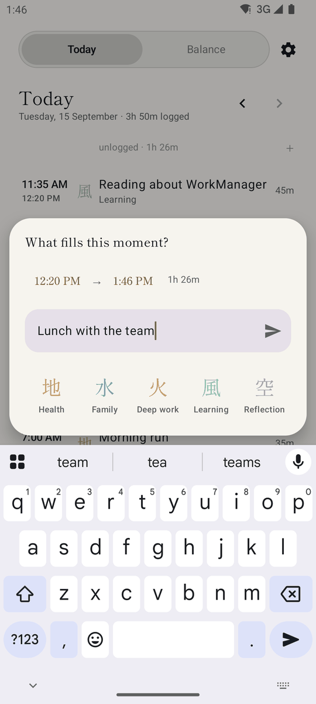
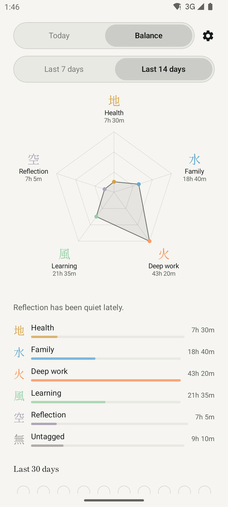
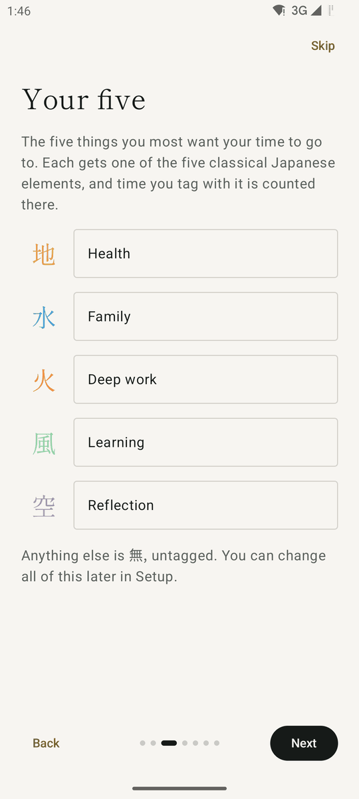
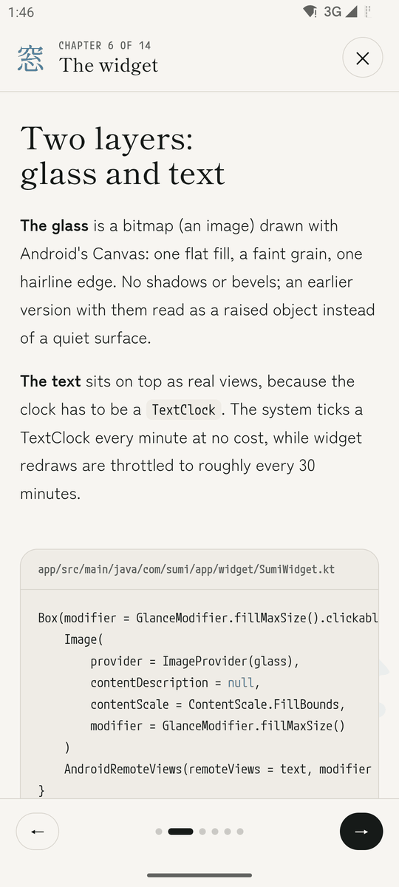

# Sumi 墨

**A quiet record of where your time goes.**

[](https://github.com/prsrwt/Sumi/actions/workflows/build.yml)



Sumi is an Android home-screen widget and a small app. The widget shows the time. Every so often it turns into a gentle question, like *What has this hour held?* You tap it, write a line or tap one of your five goals, and it goes back to being a clock. Over days, those answers become a timesheet and a picture of where your time went.

No streaks, no scores, no notifications. A missed hour is just a missed hour.

| Today | Composer | Balance | Introduction | Study guide |
|:---:|:---:|:---:|:---:|:---:|
|  |  |  |  |  |

*Screenshots use made-up sample data.*

## What it does

- **Asks, never nags.** The widget turns into a question once your chosen interval (30, 45, 60 or 90 minutes) has passed since your last entry, and stays quiet during quiet hours.
- **One tap to log.** Tap a kanji to log the time to that goal, type a line for anything else, or both.
- **Five goals, five elements.** Your goals are paired with the Godai, the five classical Japanese elements: 地 Earth, 水 Water, 火 Fire, 風 Wind and 空 Void. Name Fire "Workout" and it is called Workout everywhere. Time with no element is 無, untagged.
- **Ready-made fives.** Behind the mark at the top left: a wheel asking how your life looks now, with the pentagon beside it changing shape as the wheel turns. The sets come from the nine divisions of the UN time use classification, collapsed five different ways, and each one says what it gives up.
- **Domains, not activities.** Each of the five is chosen from a list of domains, each with a line saying what it holds, because "Health" grows over a year while "gym" stays a sliver. Writing your own is always the last choice.
- **Your own words.** An element can hold several parts of life, and each holds words: run, thesis, chai with dad. They arrive ready to tap, drawn from the UN and US time use classifications, and anything you type is offered a home after the hour is logged.
- **Today.** The day as a timesheet, with unlogged gaps you can tap to fill.
- **Balance.** A pentagon of the last 7 or 14 days and a dated 30-day grid, showing where to push and where you may be pushing too hard: a gentle note when a goal has been quiet lately, or when one has taken more than half your time.
- **Shape, not figures.** Balance carries no hours at all: the length of a spoke and of a bar is the amount. The exact times stay where they are needed, in the composer, on Today, in your Google Sheet, and in what a screen reader reads aloud.
- **Every day you have logged.** Tap the grid to open month calendars you can scroll back through, and tap any day to see what it held.
- **Google Sheets, optional.** Behind the mark at the top left, Sumi keeps a spreadsheet in your own Google Drive up to date, one tab per month, even after being offline.
- **Inside Sumi.** A slideshow study guide to how the app is built, readable inside the app.
- **Readable by screen readers.** With TalkBack on, the pentagon, the 30-day grid, every row and every kanji are described in plain words.

## The research behind it

Sumi borrows two methods from psychology: **experience sampling**, which prompts people to record what they are doing in the moment, and the **Day Reconstruction Method**, which rebuilds a day as episodes with a start and an end. Research on lapsing shows that pressure, like a broken streak, makes people quit, so the app follows a few fixed rules:

- No streaks, badges or points.
- No red anywhere; low time reads as quiet, never as a warning.
- Exactly five goals.
- Shares of time, not counts.
- Rolling windows (the last 7 or 14 days), never calendar weeks.
- Descriptive words: "Water has been quiet lately", never "You failed".
- Balance means time shared across what matters to you ([Sheldon, Cummins and Kamble, 2010](https://onlinelibrary.wiley.com/doi/abs/10.1111/j.1467-6494.2010.00644.x)), so Sumi notes when one goal takes more than half your time, or averages more than 55 hours a week, the level the [WHO and ILO](https://www.who.int/news/item/17-05-2021-long-working-hours-increasing-deaths-from-heart-disease-and-stroke-who-ilo) link to heart disease and stroke. That same research found no single balanced shape to aim at, which is why Sumi draws no target: the chapter **Where to push, and where you are pushing too hard** in the study guide sets out the whole argument.
- The chapter **How the idea came together** in the study guide is the whole story in one place: the question, every paper we read, and the turn each one forced.
- The ready-made fives collapse the nine divisions of the UN time use classification ([ICATUS 2016](https://unstats.un.org/unsd/classifications/Family/Detail/2083)) into five spokes, and two of them give unpaid work at home its own spoke, because worldwide it is 4 hours 25 minutes a day for women against 1 hour 23 for men ([ILO](https://www.ilo.org/sites/default/files/wcmsp5/groups/public/@dgreports/@dcomm/@publ/documents/publication/wcms_633135.pdf)).

## How it is built

| Part | What it uses |
|---|---|
| Language | Kotlin 2.0 |
| Screens | Jetpack Compose, Material 3 |
| Widget | RemoteViews drawn directly, with Mincho text drawn into images and a live system clock |
| Data | Room (SQLite), with exported schemas and tested migrations |
| Timing | AlarmManager, one alarm for the next moment the widget should change |
| Sync | Google Play services authorization, the Sheets and Drive REST APIs over plain HTTPS, WorkManager |
| Android | 8.0 (API 26) and later, built for Android 16 (API 36) |

To learn how every part works, read **Inside Sumi**: 17 short chapters with the real code, from the idea to release. Open it in the app from **Setup, About, Inside Sumi**, or read [`docs/index.html`](docs/index.html) (once GitHub Pages is on, at [prsrwt.github.io/Sumi](https://prsrwt.github.io/Sumi/)).

## Build it

You need Android Studio (or JDK 17 with the Android SDK, platform 36).

```sh
git clone https://github.com/prsrwt/Sumi.git
cd Sumi
./gradlew installDebug        # build and install on a connected phone or emulator
./gradlew testDebugUnitTest   # run the unit tests
```

**Release builds** are signed with a key kept outside the project. To build one, create `~/.sumi-signing/keystore.properties`:

```properties
storeFile=/absolute/path/to/your-release.jks
storePassword=...
keyAlias=...
keyPassword=...
```

Without that file, release builds are left unsigned and debug builds are unaffected. Never commit a keystore or its passwords.

**House rule:** the project uses no em dashes, in code, comments or docs. Every build checks for them first and stops, naming the file and line, if it finds one.

## Google Sheets in your own build

Google recognises the app by its package name and signing certificate, so no client ID is stored in the code, and a build of your own needs its own Google Cloud project:

1. Change `applicationId` in [`app/build.gradle.kts`](app/build.gradle.kts) to a name you own.
2. In the [Google Cloud console](https://console.cloud.google.com/), create a project and enable the **Google Sheets API** and **Google Drive API**.
3. In **Google Auth Platform**, set up branding, choose an **External** audience and add yourself as a test user, then add the `https://www.googleapis.com/auth/drive.file` scope under **Data access**.
4. Under **Clients**, create an **Android** client with your package name and the SHA-1 fingerprint from `./gradlew signingReport`. Create one client for each key you sign with, for example debug and release.

## Privacy

- Your log stays on your phone, in Sumi's own database.
- No accounts, analytics, ads or Sumi servers.
- Sumi uses the internet only to reach Google once you connect Google Sheets, and, in the study guide, to load its web fonts from Google Fonts.
- With Sheets connected, Sumi can see only the one spreadsheet it creates (the `drive.file` permission), never the rest of your Drive.

The policy published with the app is [`docs/privacy.html`](docs/privacy.html), served at [prsrwt.github.io/Sumi/privacy.html](https://prsrwt.github.io/Sumi/privacy.html) once GitHub Pages is on.

## Releasing

Version numbers live in [`version.properties`](version.properties), read by the build, and `versionCode` has to rise for every upload Google Play accepts. [`RELEASE.md`](RELEASE.md) is the whole route to the store: cutting a build, the listing copy, the data safety answers, the OAuth consent screen, and the certificate change that silently breaks Google Sheets if it is missed.

## Project layout

```text
app/src/main/java/com/sumi/app/
  MainActivity.kt   tabs, Setup, You and the introduction
  data/             elements, database, repository, and the time logic
  ui/composer/      the log sheet opened from the widget
  ui/today/         the timesheet
  ui/balance/       the pentagon and the 30-day grid
  ui/setup/         Setup, and the goal rows and Sheets section it lends out
  ui/account/       You: the five, the wheel of ready-made fives, Google Sheets
  ui/onboarding/    the first-launch introduction
  ui/guide/         the study guide screen
  widget/           the widget, glass, Mincho text and alarms
  sync/             Google authorization, HTTPS, the spreadsheet and WorkManager
app/src/test/       unit tests
app/schemas/        every database version's layout
docs/               the study guide, the privacy policy and these screenshots
```

## Credits

- Titles and kanji are set in [Shippori Mincho](https://fonts.google.com/specimen/Shippori+Mincho) by the Shippori Mincho Project Authors, under the SIL Open Font License 1.1. The app bundles a subset, and its licence is readable from Setup.
- The study guide also uses [Zen Kaku Gothic New](https://fonts.google.com/specimen/Zen+Kaku+Gothic+New) and [M PLUS 1 Code](https://fonts.google.com/specimen/M+PLUS+1+Code), under the same licence.

## Copyright

© 2026 prsrwt. All rights reserved.

The source is public to read and learn from. It is not licensed for reuse, modification, redistribution or publication, and the Sumi name and ensō icon are not licensed for any use.
